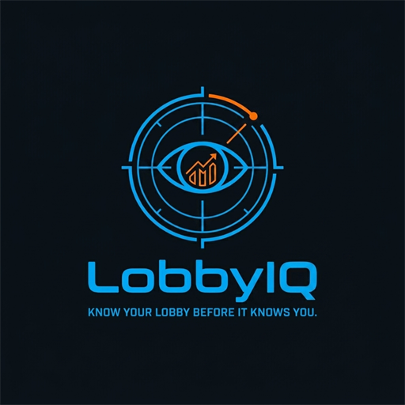

# LobbyIQ

Live scoreboard for Rocket League that shows **everyone in the lobby, with
their rank and MMR** — teammates and opponents alike — plus how many matches
you have played with each of them before. Optionally publishes the match to
Discord as a Rich Presence card.

Windows only, because it reads Rocket League's own local Stats API and that API
is Windows only.

## What it shows

| Column | Where it comes from |
| --- | --- |
| TEAM / NAME / PLATFORM | Rocket League's Stats API |
| RANK | the player's rank badge, drawn from the bundled art |
| MMR | Rocket League's backend, tinted by rank |
| GOALS / ASSISTS / SAVES | the live match |
| GAMES | how many matches you've shared with that player, remembered across sessions |

A dropdown picks which playlist the RANK and MMR columns report, so you can sit
in a 3v3 and look at everyone's 2v2. **Current mode** follows whatever you are
playing.

Your own row is bold. LobbyIQ works out which player is you by watching which
one the camera follows, so there is nothing to configure.

## Install

Download the latest **LobbyIQ-Setup-*.exe** from
[Releases](https://github.com/ShakedShitrit/lobby-iq/releases) and run it.

It installs for you alone, so there is no admin prompt. It creates a desktop
shortcut, writes a starting `config.yaml`, and switches on Rocket League's
match export so the app works the first time you open it.

**Close Rocket League first.** The game rewrites its own settings when it
exits, which would undo that last step. The installer checks, and offers to
retry if it finds the game running.

### Building it yourself

```
go build
```

That produces `lobby-iq.exe`, which opens the GUI when double-clicked. See
[BUILD.md](BUILD.md) for the Windows specifics and for building the installer.

Copy `config.example.yaml` to `config.yaml` and edit it — every setting is
documented in the file. Running without one is fine; the defaults apply.

Then run `lobby-iq setup` once, which is what the installer does for you: it
points Rocket League's Stats API at the port LobbyIQ listens on. `lobby-iq
setup --dry-run` shows what it would change without touching anything.

### If matches stop appearing

Run `lobby-iq setup` again. A Rocket League update can regenerate
`TAStatsAPI.ini` from the game's own defaults and undo the change; the command
is safe to run as often as you like, and says "already correct" when there is
nothing to do.

### Rank and MMR need a one-time Epic sign-in

```
lobby-iq link
```

or press **Sign in to Epic** in the GUI. It opens Epic's own sign-in page; you
paste back the code it ends on. The token is written to
`%APPDATA%\rlmmr\credentials.json`, never to `config.yaml`.

> [!IMPORTANT]
> **Sign in with a second Epic account, not the one you play on.**
>
> Rocket League's backend allows one live session per account and evicts the
> older one. Signing in as the account that is in the game makes it announce
> *"you are not connected to the Epic Games online services"* — and with
> `lobby_mmr` on, that lands at kickoff and costs you the whole match.
>
> Ratings are public, so a second account can read yours and everyone else's
> perfectly well. A free account is enough.

### Discord Rich Presence

Works out of the box — `config.example.yaml` ships a client ID and the art is
already uploaded to it, so there is no developer portal detour. Clear
`discord_client_id` to turn it off, or point it at your own application to
carry your own name and art. Details in [DISCORD.md](DISCORD.md).

## Command line

The GUI is the default; the flags are there when you want them.

```
lobby-iq                  desktop GUI
lobby-iq --lightweight    terminal UI instead
lobby-iq link             Epic sign-in
lobby-iq --help
```

Every setting can also be given as `LOBBYIQ_*` in the environment, or in
`config.yaml`. Flags win, then environment, then the file.

## Files it writes

Next to the exe, or the working directory if that is where `config.yaml` was
found:

- `lobby-iq.log` — the log; `--log-level debug` for more
- `players.json` — the GAMES column's history
- `self.json` — which player it worked out is you

None of them are secret, but all of them name real people, so they are
gitignored.

## Layout

```
cmd/                CLI commands (cobra)
internal/rlstats/   reads Rocket League's local Stats API
internal/lobby/     rank and MMR for every player, cached per playlist
internal/selfid/    works out which player is the local one
internal/liverank/  your own rank, for the Discord card
internal/presence/  builds the Discord Rich Presence card
internal/discord/   Discord IPC client
internal/app/       the GUI, the terminal UI, and the Epic sign-in window
assets/ranks/       rank badges, embedded into the binary
```

Talking to Rocket League's backend is
[ShakedShitrit/rlmmr](https://github.com/ShakedShitrit/rlmmr), a separate
module.

## A caveat worth stating

Rocket League has no supported API for any of this. LobbyIQ reads a local
socket the game itself offers, but the rank and MMR lookups go to Psyonix's
backend as an automated client, which their terms of service do not
contemplate. That risk lands on whichever account you sign in with — one more
reason for it to be the spare one.
